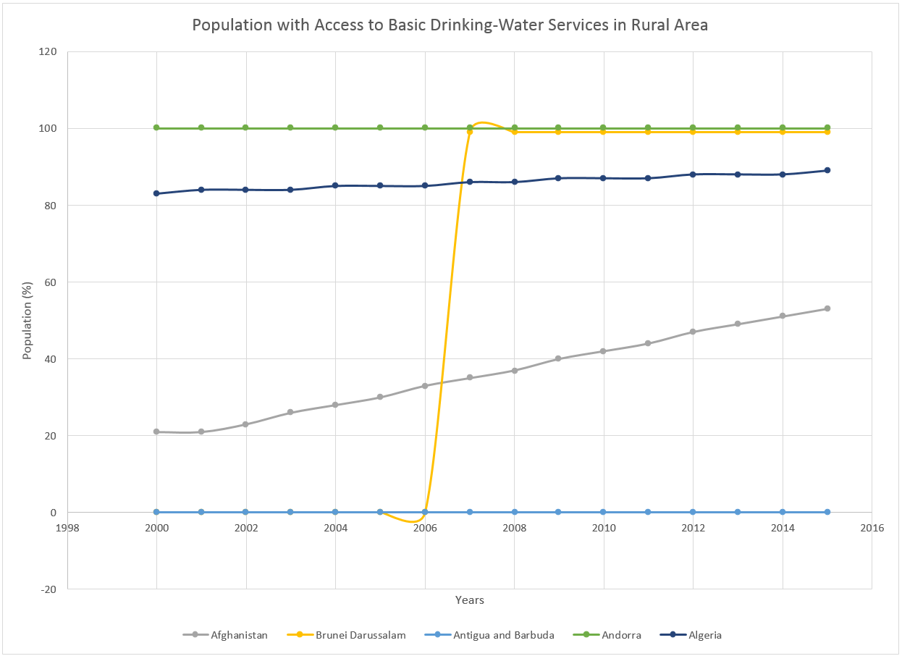
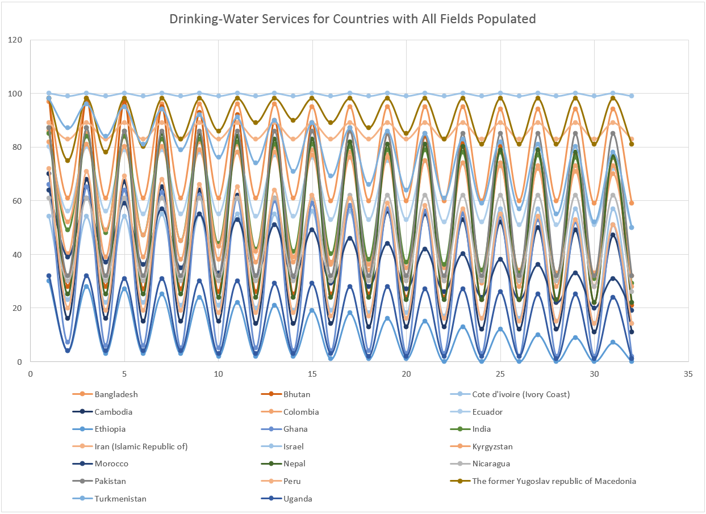
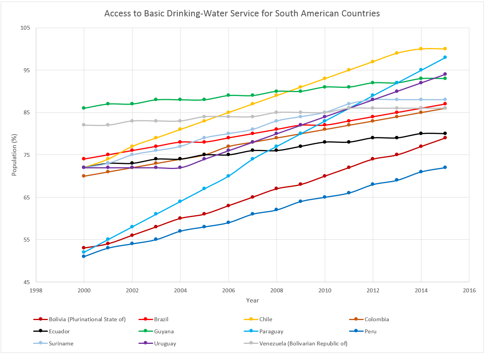
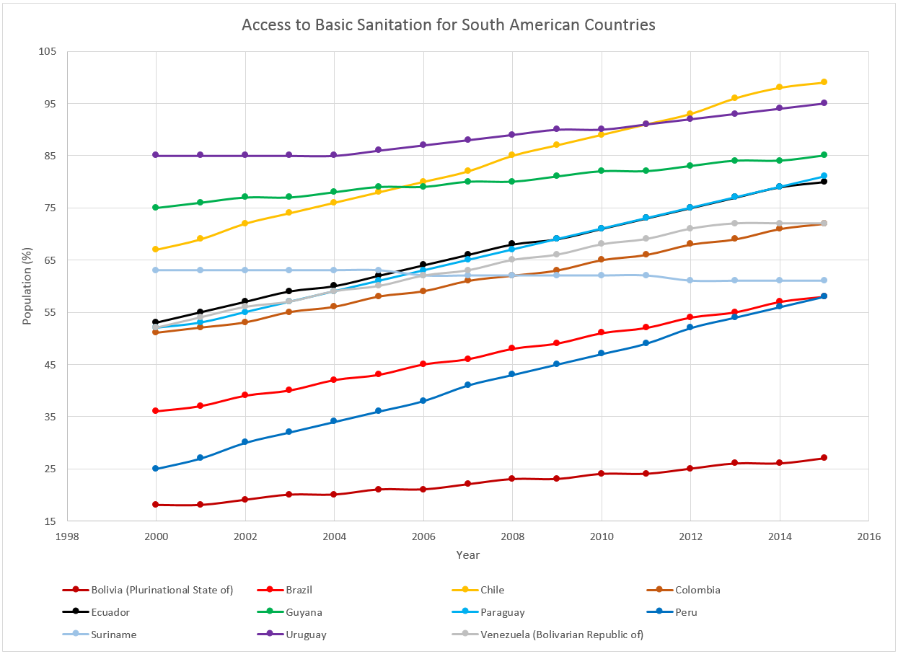
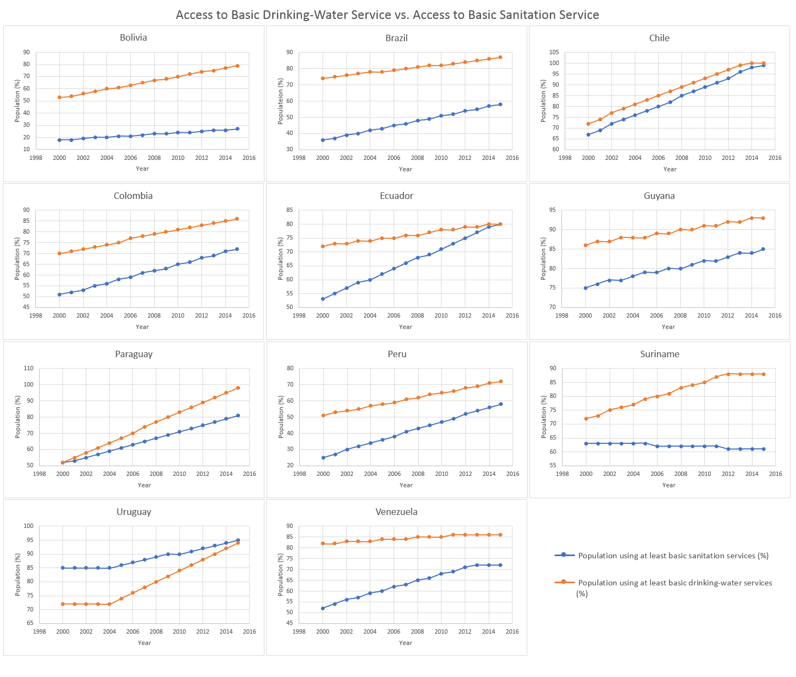

# Exploratory Analysis Process
Starting with the datasets and proposed questions from [Homework 5](https://git-community.cs.odu.edu/ediep/CS725-HW5), I had to explore the dataset for each question to see which dataset and question was feasible to continue exploring.

The initial question is, how has the access to drinking water and sanitation changed over time for rural areas?

The dataset I am using for analysis is provided by World Health Organization. The dataset used are [basic and safely managed sanitation services data](http://apps.who.int/gho/data/node.main.WSHSANITATION?lang=en), and [basic and safely managed drinking water services data](http://apps.who.int/gho/data/node.main.WSHWATER?lang=en).

For the dataset, CSV files were provided and they were not formatted -- no borders, duplicate header columns. Thus, I had to format the files to allow for it to be easier to explore. Within the dataset, there are columns rating the country's access to basic services and managed services for both sanitation and drinking water services. Basic sanitation service is defined as improved sanitation facilities that are not shared with other households. Managed sanitation service is defined as improved sanitation facility where excreta are safely disposed of in situ or treated off site. Basic drinking water service is defined as where drinking water from an improved source where the population does not have to travel more than 30 minutes round-trip. Managed drinking water service is defined as where drinking water is accessible on premises and free from faecal and chemal contamination. 

Both dataset file layout are identical, so after I figure out what transformation I need for one, I will replicate for the other. Since I am only interested in the ratings for rural areas, I removed columns from the dataset that were not not of interest. The dataset had blank values, I assumed they were zero and populated them with "0".

Below chart is the initial chart created for one country to see how the chart would look like.

Looking at the initial chart and the dataset, it would not be feasible to plot the basic and managed drinking-water services ratings for 194 countries for 15 years. This would cause the graph to be illegible and unmeaningful. Thus, I limited to only countries where they had both basic managed drinking-water services rating populated. Below is the chart produced.

The chart produced plots the points incorrectly by connecting both basic and managed ratings. Also, the years were not selected as the x-axis. After seeing this, I decided to narrow the question, how has the access to basic drinking-water and sanitation changed over time for rural areas? 

After narrowing the question, columns that did not pertain to basic drinking-water service were removed. As I explore the smaller dataset, I noticed there were countries where they had the rating was either 0%, or between 90% to 100% of rural populating having access to basic drinking for all years. I decided to filter out these countries, and the size of the dataset was reduced further. Though the dataset has been filtered, the number of remaining countries is over 100. This would be infeasible to plot and display within a chart. 

I added a new column for that would hold the continent each country is located in. Adding the column will help further filter the data. As I filtered on the new continent column, I decided to narrow the data for analysis to countries within Asia. The question is now, how has the access to basic drinking-water and santitation changed over time for rural areas for countries in South America?

The graph below represents the data filtered for South American countries with basic access to drinking-water service.

The graph below represents the data filtered for South America countries with basic sanitation service.

I combined the datasets to easier analyze the change to access of basic drinking-water and sanitation over time for South American countries. After combining the data, I had to think of a way to present the data in a meaningful way. I came to a conlusion of using small multiple line charts to present both the change over year for access to basic drinking-water service and basic sanitation for each country.

# References
 * [CS725, Spring 2018 - Homework 5](https://git-community.cs.odu.edu/ediep/CS725-HW5)
 * [Basic and safely managed sanitation services Data by country by World Health Organization](http://apps.who.int/gho/data/node.main.WSHSANITATION?lang=en)
 * [Basic and safely managed drinking water services Data by country by World Health Organization](http://apps.who.int/gho/data/node.main.WSHWATER?lang=en)